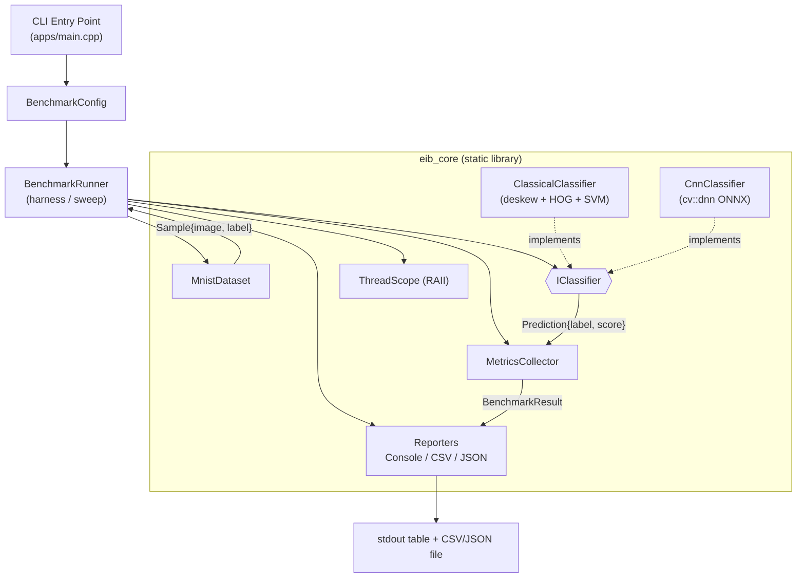

# EdgeInferenceBenchmark

A small, self-contained C++ benchmark suite that compares two implementations of
the **same** computer-vision task — handwritten digit classification on MNIST —
on **CPU only**:

- a **classical OpenCV pipeline** (moment-based deskew → HOG features →
  `cv::ml::SVM`), and
- a **lightweight CNN** (LeNet-style ONNX model run through OpenCV's `cv::dnn`
  module on the CPU backend).

Both methods take an identical input (28×28 grayscale image) and produce an
identical output schema (`Prediction{label 0–9, score}`), so the comparison is
apples-to-apples. The harness measures latency (p50/p95/mean) and throughput
across two execution targets (single-thread and all-cores) and reports accuracy
alongside, giving a defensible "classical CV vs. small CNN" trade-off study on
commodity hardware.

The goal is a portfolio-quality demonstration of clean C++17, a reproducible
benchmarking methodology, and a small but complete SDLC (requirements → design →
implementation → QA → release → docs).

---

## What it demonstrates

- **Polymorphic classifier seam** — a single `IClassifier` interface implemented
  by both `ClassicalClassifier` and `CnnClassifier`; everything upstream
  (loader, runner, metrics, reporter) is implementation-agnostic and
  unit-testable against a stub.
- **Honest benchmarking** — warmup iterations are discarded; only the
  per-image `predict()` call (preprocessing + inference) is timed with
  `std::chrono::steady_clock`; model/data loading happens once, outside any
  timed region.
- **Two execution targets** — the same classifier instance is swept across a
  single-thread and an all-cores target via an RAII `ThreadScope` around
  OpenCV's thread control.
- **Machine-readable output** — console table plus optional CSV and JSON, each
  carrying a full run-metadata header (OS, CPU, compiler, OpenCV version,
  warmup/iterations, timestamp).
- **Deterministic results** — predicted labels and accuracy are
  thread-invariant; only timings vary between runs.
- **Graceful degradation** — a missing model artifact skips only the affected
  method (with a warning) instead of aborting the whole run; malformed inputs
  fail fast with a clear message and a non-zero exit code.

---

## Architecture overview

The suite is a single-process command-line application built around one static
library (`eib_core`) consumed by the app (`edge_inference_benchmark`) and the
test executable (`eib_tests`). Data flows in one direction: the CLI parses a
`BenchmarkConfig`, the MNIST IDX loader reads samples into memory, the runner
drives each classifier across each execution target, the metrics collector
timestamps every measured prediction and computes statistics, and a reporter
emits the console table plus CSV/JSON.



See [docs/design/DESIGN.md](docs/design/DESIGN.md) for the full design and
[docs/requirements/SRS.md](docs/requirements/SRS.md) for scope.

---

## Building

Requirements:

- **CMake >= 3.20**
- A **C++17** compiler (GCC or Clang)
- **OpenCV** (system install) with the `core`, `imgproc`, `ml`, `dnn`, and
  `objdetect` components — on Debian/Ubuntu: `sudo apt install libopencv-dev`
- **GoogleTest** is fetched/discovered automatically for the test build; no
  manual install is required.

```bash
cmake -S . -B build -DCMAKE_BUILD_TYPE=Release
cmake --build build --parallel
```

This produces:

- `build/edge_inference_benchmark` — the benchmark CLI
- `build/eib_train_svm` — the offline SVM trainer (built when
  `-DEIB_BUILD_TOOLS=ON`, the default)
- `build/tests/eib_tests` — the unit-test suite (built when
  `-DEIB_BUILD_TESTS=ON`, the default)

The build alone requires **no** dataset or model artifacts.

---

## Provisioning data & models

The MNIST dataset and the model artifacts are **generated locally and
gitignored** — they are not committed to the repository. Provision them with the
helpers in `scripts/` (which live outside the benchmarked code path). See
[scripts/README.md](scripts/README.md) for details.

### 1. Data

Downloads the real MNIST IDX files into `data/` (falls back to a tiny synthetic
sample if the network is unavailable — accuracy is then not meaningful). Pure
Python standard library, no dependencies.

```bash
python3 scripts/prepare_data.py
```

Produces `t10k-images-idx3-ubyte`, `t10k-labels-idx1-ubyte`,
`train-images-idx3-ubyte`, and `train-labels-idx1-ubyte` in `data/`.

### 2. Classical SVM model

Trained by the `eib_train_svm` C++ tool, which links `eib_core` to reuse the
**exact** HOG configuration used at inference time (keeping the model compatible
with `ClassicalClassifier`):

```bash
./build/eib_train_svm \
    --images data/train-images-idx3-ubyte \
    --labels data/train-labels-idx1-ubyte \
    --out    models/mnist_svm.xml \
    --max    5000
```

### 3. CNN ONNX model

`scripts/export_lenet.py` **trains** a LeNet-style CNN on the real MNIST
training split and only then exports `models/mnist_lenet.onnx`. It requires a
CPU build of **PyTorch** plus **onnx**, and fails loudly (non-zero exit, no file
written) if those are missing, the data is absent/synthetic, or the trained test
accuracy falls below `--min-accuracy` (default 0.97):

```bash
pip install torch onnx
python3 scripts/export_lenet.py --out models/mnist_lenet.onnx --epochs 3
```

---

## Running the benchmark

The CLI flags (from `apps/main.cpp`):

| Flag | Description | Default |
| --- | --- | --- |
| `--images PATH` | MNIST IDX3 image file (**required**) | — |
| `--labels PATH` | MNIST IDX1 label file (**required**) | — |
| `--svm PATH` | classical SVM model (`.xml`/`.yml`) | — |
| `--onnx PATH` | LeNet-style ONNX model (`.onnx`) | — |
| `--methods LIST` | comma list of `classical`,`cnn` | both |
| `--max-images N` | evaluated set size | 200 |
| `--warmup N` | discarded warmup iterations | 20 |
| `--iterations N` | measured iterations | 200 |
| `--csv PATH` | write CSV results to `PATH` | — |
| `--json PATH` | write JSON results to `PATH` | — |
| `--help` / `-h` | show usage | — |

The two execution targets — `single-thread` (1 thread) and `all-cores` (OpenCV
default) — are built in; each result row is labeled with its target and thread
count.

A representative command:

```bash
./build/edge_inference_benchmark \
    --images data/t10k-images-idx3-ubyte \
    --labels data/t10k-labels-idx1-ubyte \
    --svm    models/mnist_svm.xml \
    --onnx   models/mnist_lenet.onnx \
    --max-images 2000 --warmup 20 --iterations 200 \
    --csv out/results.csv --json out/results.json
```

If a model artifact is absent, the corresponding method is skipped with a
warning and the run continues with the remaining method(s).

---

## Results

Headline latency/throughput/accuracy across both CPU targets for both methods.
These are the numbers captured during QA (see
[docs/qa/QA_REPORT.md](docs/qa/QA_REPORT.md)), measured over 2000 images with 20
warmup and 200 measured iterations:

| Method | Target | Threads | p50 (ms) | p95 (ms) | Mean (ms) | Throughput (items/s) | Accuracy |
| --- | --- | ---: | ---: | ---: | ---: | ---: | ---: |
| classical | single-thread | 1 | 0.2932 | 0.5021 | 0.3325 | 3007.37 | 98.65% |
| classical | all-cores | 8 | 0.3031 | 0.5139 | 0.3358 | 2978.15 | 98.65% |
| cnn | single-thread | 1 | 0.1164 | 0.1790 | 0.1268 | 7883.85 | 97.50% |
| cnn | all-cores | 8 | 0.0802 | 0.0947 | 0.0807 | 12384.33 | 97.50% |

**Measured on:** Intel Core i7-6700 @ 3.40GHz (4C/8T), Linux, GCC 13.3.0,
OpenCV 4.6.0, Release build.

**Interpretation.** On this CPU the lightweight CNN is faster *per item* and
delivers substantially higher throughput than the classical HOG+SVM pipeline
(roughly 2–4× the items/second), while the classical pipeline is slightly more
accurate (98.65% vs 97.50%). The CNN also benefits from multi-threading
(single-thread → all-cores roughly halves its p50 and boosts throughput to
~12.4k items/s), whereas the classical path is essentially flat across the two
targets — its per-image work does not parallelize the same way here. This is the
classic latency-vs-accuracy trade-off the suite is designed to surface. Absolute
numbers will vary by machine, OpenCV build, and thread count; treat them as
relative indicators rather than fixed figures.

---

## Testing

The suite ships **18 unit tests** covering IDX parsing/validation, the
percentile/metrics math, the classifier seam (via a stub), and reporter
formatting. They run in a fraction of a second and require **no** MNIST data or
model artifacts:

```bash
cmake --build build --parallel
ctest --test-dir build --output-on-failure
```

---

## Project layout

```
EdgeInferenceBenchmark/
├── CMakeLists.txt              # top-level build, install, CPack
├── VERSION                     # single source of truth for the version (0.1.0)
├── LICENSE                     # MIT
├── cmake/EibHelpers.cmake      # warning flags, sanitizer toggle
├── include/eib/                # public headers (IClassifier, dataset, metrics, ...)
├── src/
│   ├── dataset/                # MNIST IDX loader
│   ├── classifier/             # classical + CNN classifiers, HOG, factory
│   ├── benchmark/              # config, thread scope, metrics, runner
│   ├── report/                 # console / CSV / JSON reporters
│   └── platform/               # run-metadata capture
├── apps/main.cpp               # CLI entry point
├── scripts/                    # data + model provisioning (out of the timed path)
├── tests/                      # GoogleTest suite (18 tests)
├── data/                       # MNIST IDX files (gitignored, provisioned locally)
├── models/                     # SVM + ONNX artifacts (gitignored, provisioned locally)
└── docs/                       # requirements, design, QA, release, status
```

---

## Continuous integration

Two mirrored pipelines run the same gate on Ubuntu:

- **GitHub Actions** — [.github/workflows/ci.yml](.github/workflows/ci.yml)
- **GitLab CI** — [.gitlab-ci.yml](.gitlab-ci.yml)

Both configure in Release, build all targets, run the 18 unit tests via `ctest`
(the required gate), and build a TGZ package with CPack. The gate needs no MNIST
data or model artifacts, so CI is fully self-contained. See
[docs/release/RELEASE.md](docs/release/RELEASE.md) for the release process.

---

## License

Released under the [MIT License](LICENSE). The MNIST dataset and all model
artifacts are generated locally from redistributable sources; no third-party
weights are vendored.
