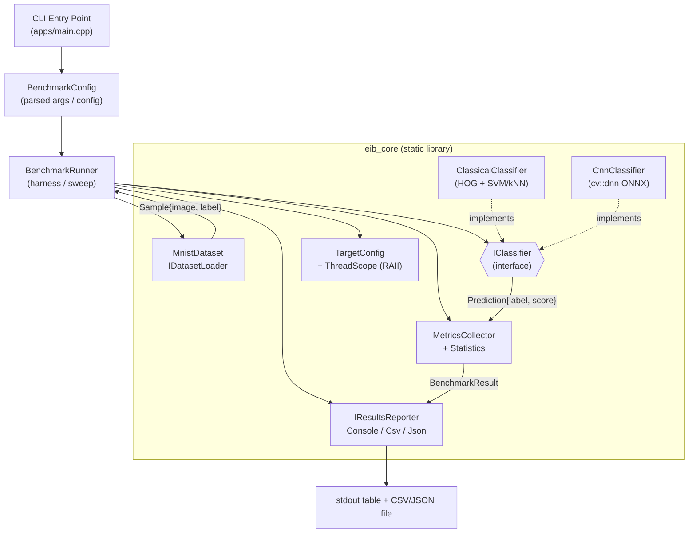

# EdgeInferenceBenchmark — Design Document Specification (DDS)

Status: Draft for developer hand-off
Stage: Design
Source of truth: [docs/requirements/SRS.md](../requirements/SRS.md)
Language / Standard: C++17
Build system: CMake (>= 3.20)
Primary dependency: OpenCV (`core`, `imgproc`, `ml`, `dnn`) via `find_package(OpenCV)`
Test framework: GoogleTest (per OQ-6 resolution below)

This document translates the approved SRS into a concrete, implementable C++
design. It defines module boundaries, public interfaces, the CMake target
layout, data/model handling, timing methodology, testing hooks, and ownership
conventions. Requirement IDs from the SRS are referenced inline as `(FR-x)`,
`(MET-x)`, `(TR-x)`, etc.

---

## 1. High-Level Architecture

### 1.1 Narrative

The suite is a single-process, single-host command-line application. Data flows
in one direction: the CLI parses configuration, the dataset loader reads the
MNIST IDX files into memory, the benchmark runner drives one or more
`Classifier` implementations across the configured execution targets, a metrics
collector timestamps each measured prediction and computes statistics, and a
results reporter emits both a console table and a machine-readable file.

The central abstraction is the polymorphic **`Classifier`** interface
`(FR-2, FR-3, FR-4)`. Both the classical OpenCV pipeline and the ONNX CNN
implement it, guaranteeing identical input (28×28 grayscale `cv::Mat`) and
identical output schema (`Prediction{label, score}`). Everything upstream of the
interface (loader, runner, metrics, reporter) is implementation-agnostic and
therefore unit-testable against a stub classifier.

Components are grouped into a single static library (`eib_core`) consumed by one
application executable (`edge_inference_benchmark`) and the test executable
(`eib_tests`). This keeps the surface small and idiomatic while allowing the
tests to link the same code the app runs.

### 1.2 Component diagram



### 1.3 End-to-end data flow

1. `main` builds a `BenchmarkConfig` from CLI args `(FR-12)`.
2. `MnistDataset::load()` reads IDX image + label files into a `vector<Sample>`
   `(FR-1)`; fails fast on missing/malformed files `(FR-14)`.
3. `ClassifierFactory` constructs the requested `IClassifier` implementations,
   loading model artifacts once, before timing begins `(NFR-8)`.
4. For each `(classifier × TargetConfig)` pair `(FR-9, TR-1)`:
   - Apply the target's thread setting via an RAII `ThreadScope` `(TR-3)`.
   - Run `warmup` predictions, discarded `(MET-1)`.
   - Run `iterations` measured predictions, timing each with `steady_clock`
     `(MET-2, MET-3)`; feed samples cyclically over the evaluated set.
   - `MetricsCollector` records per-item durations and correctness.
5. `MetricsCollector::finalize()` computes p50/p95/mean/min/max, throughput, and
   accuracy per `(method × target)` `(MET-4, MET-5, MET-6)`.
6. `IResultsReporter` writes the console table `(FR-10)` and the CSV/JSON file
   `(FR-11)`, including run metadata `(FR-13)`.

---

## 2. Module Boundaries & Directory Layout

Small, idiomatic split of public headers (`include/`) from implementation
(`src/`). Public headers live under an `eib/` prefix directory to namespace
includes (`#include "eib/classifier.hpp"`).

```
EdgeInferenceBenchmark/
├── CMakeLists.txt                 # top-level: project(), options, subdirs
├── conanfile.py                   # (optional) OpenCV/GTest pinning; see §3.4
├── cmake/
│   └── EibHelpers.cmake           # warning flags, sanitizer toggles
├── include/
│   └── eib/
│       ├── types.hpp              # Sample, Prediction, common aliases
│       ├── dataset.hpp            # IDatasetLoader, MnistDataset
│       ├── classifier.hpp         # IClassifier, Prediction
│       ├── classical_classifier.hpp
│       ├── cnn_classifier.hpp
│       ├── classifier_factory.hpp
│       ├── benchmark_config.hpp   # BenchmarkConfig, TargetConfig
│       ├── thread_scope.hpp       # RAII OpenCV thread control
│       ├── metrics.hpp            # MetricsCollector, Statistics, BenchmarkResult
│       ├── runner.hpp             # BenchmarkRunner
│       ├── reporter.hpp           # IResultsReporter + Console/Csv/Json
│       └── run_metadata.hpp       # RunMetadata capture
├── src/
│   ├── dataset/mnist_dataset.cpp
│   ├── classifier/classical_classifier.cpp
│   ├── classifier/cnn_classifier.cpp
│   ├── classifier/classifier_factory.cpp
│   ├── benchmark/thread_scope.cpp
│   ├── benchmark/metrics.cpp
│   ├── benchmark/runner.cpp
│   ├── report/console_reporter.cpp
│   ├── report/csv_reporter.cpp
│   ├── report/json_reporter.cpp
│   └── platform/run_metadata.cpp
├── apps/
│   └── main.cpp                   # CLI entry point → edge_inference_benchmark
├── tests/
│   ├── CMakeLists.txt
│   ├── test_mnist_dataset.cpp
│   ├── test_metrics.cpp
│   ├── test_runner_with_stub.cpp
│   ├── test_reporter.cpp
│   └── data/                      # tiny fixed IDX fixtures for parsing tests
├── models/                        # vendored SVM artifact + LeNet .onnx (A-1, A-2)
│   ├── README.md                  # provenance + license (OQ-3)
│   ├── mnist_svm.xml
│   └── mnist_lenet.onnx
├── data/                          # vendored MNIST test subset (A-3, OQ-4)
│   ├── README.md
│   ├── t10k-images.idx3-ubyte
│   └── t10k-labels.idx1-ubyte
└── docs/
    ├── requirements/SRS.md
    └── design/DESIGN.md           # this file
```

Rationale (trade-off): a **single `eib_core` library** rather than one library
per module. For a suite this size, per-module libraries add CMake boilerplate
and link-order noise without real decoupling benefit. The `IClassifier`
interface already provides the one seam that matters for testing.

---

## 3. CMake Target Layout

### 3.1 Targets

| Target | Type | Purpose |
| --- | --- | --- |
| `eib_core` | `add_library(... STATIC)` | All loader/classifier/metrics/reporter code. |
| `edge_inference_benchmark` | `add_executable` | CLI app; links `eib_core`. `(apps/main.cpp)` |
| `eib_tests` | `add_executable` | GoogleTest suite; links `eib_core` + `GTest::gtest_main`. |

### 3.2 Dependency wiring

```cmake
cmake_minimum_required(VERSION 3.20)
project(EdgeInferenceBenchmark LANGUAGES CXX)

set(CMAKE_CXX_STANDARD 17)
set(CMAKE_CXX_STANDARD_REQUIRED ON)
set(CMAKE_CXX_EXTENSIONS OFF)

find_package(OpenCV REQUIRED COMPONENTS core imgproc ml dnn)

add_library(eib_core STATIC ${EIB_CORE_SOURCES})
target_include_directories(eib_core PUBLIC ${CMAKE_SOURCE_DIR}/include)
target_link_libraries(eib_core PUBLIC opencv_core opencv_imgproc opencv_ml opencv_dnn)
target_compile_features(eib_core PUBLIC cxx_std_17)

add_executable(edge_inference_benchmark apps/main.cpp)
target_link_libraries(edge_inference_benchmark PRIVATE eib_core)

# tests/CMakeLists.txt
find_package(GTest REQUIRED)
add_executable(eib_tests ${EIB_TEST_SOURCES})
target_link_libraries(eib_tests PRIVATE eib_core GTest::gtest_main)
include(GoogleTest)
gtest_discover_tests(eib_tests)
```

- OpenCV include dirs propagate **PUBLIC** from `eib_core` so the app and tests
  see them transitively; the app/test targets link `eib_core` **PRIVATE**.
- `enable_testing()` at the top level; `add_subdirectory(tests)` guarded by an
  `EIB_BUILD_TESTS` option (default `ON`).
- `cmake/EibHelpers.cmake` centralizes `-Wall -Wextra -Wpedantic` and an
  optional `EIB_ENABLE_SANITIZERS` toggle.

### 3.3 Dependency strategy

Primary path is **system OpenCV via `find_package(OpenCV)`** `(NFR-7, A-4)` —
simplest and most portable on Linux (`apt install libopencv-dev` or a distro
package). No second inference runtime is introduced `(NFR-7, OQ-2 resolved to
`cv::dnn` only)`.

### 3.4 Optional Conan pinning (reproducibility)

For pinned, reproducible builds `(NFR-3)` a `conanfile.py` may declare
`opencv/4.x` and `gtest/1.14.x` from ConanCenter, generating CMakeDeps targets.
This is **optional** and additive: the top-level `CMakeLists.txt` uses only
`find_package()` names, so it works with either system packages or Conan-provided
ones without change. If adopted, note in `conanfile.py` that OpenCV must be
configured with `ml`, `dnn`, and `imgproc` enabled.

---

## 4. Key Interfaces

All types live in namespace `eib`. Signatures below are **interface sketches**,
not implementation.

### 4.1 Common value types (`eib/types.hpp`)

```cpp
namespace eib {

// One evaluation item: 28x28, CV_8UC1, plus ground truth. (A-5)
struct Sample {
    cv::Mat image;      // 28x28, single channel, owns its pixels
    int     label;      // ground-truth digit 0..9
};

// Uniform classifier output schema for BOTH methods. (FR-4)
struct Prediction {
    int   label;        // predicted digit 0..9
    float score;        // confidence / decision score
};

} // namespace eib
```

### 4.2 Classifier interface (`eib/classifier.hpp`) `(FR-2, FR-3, FR-4)`

```cpp
namespace eib {

class IClassifier {
public:
    virtual ~IClassifier() = default;

    // Single-image predict: preprocessing + inference for ONE image.
    // This is the exact scope timed per iteration (MET-3, NFR-8).
    virtual Prediction predict(const cv::Mat& image28x28) const = 0;

    // Stable identifier for result labeling, e.g. "classical" / "cnn".
    virtual std::string name() const = 0;
};

// Batch/loop helper lives OUTSIDE the timed path for accuracy passes.
// Default-implemented in terms of predict(); not timed itself.
std::vector<Prediction> predict_all(const IClassifier& clf,
                                     const std::vector<Sample>& samples);

} // namespace eib
```

Design note: `predict` is `const` and stateless w.r.t. results, so the same
instance is reused across warmup + measured iterations. Any mutable scratch
buffers (e.g. a reusable blob) are `mutable` members or are re-created per call;
the classical/CNN implementations must keep `predict` free of file I/O `(NFR-8)`.

### 4.3 Classical implementation (`eib/classical_classifier.hpp`) `(FR-2)`

```cpp
namespace eib {

struct ClassicalConfig {
    std::string model_path;    // pre-fitted SVM/kNN artifact (A-2)
    bool        deskew = true; // moment-based deskew (SRS §1.2)
    // HOG parameters fixed to match the vendored model (OQ-1).
};

class ClassicalClassifier final : public IClassifier {
public:
    explicit ClassicalClassifier(const ClassicalConfig& cfg); // loads model once
    Prediction  predict(const cv::Mat& image28x28) const override;
    std::string name() const override { return "classical"; }
private:
    // owns cv::Ptr<cv::ml::StatModel> (SVM primary, kNN fallback per OQ-1)
    // owns cv::HOGDescriptor configured to the model's feature layout
};

} // namespace eib
```

### 4.4 CNN implementation (`eib/cnn_classifier.hpp`) `(FR-3)`

```cpp
namespace eib {

struct CnnConfig {
    std::string onnx_path;         // LeNet-style model (A-1)
    float       scale  = 1.f/255f; // must match training convention (SRS §1.3)
    float       mean   = 0.f;
    // Fixed CPU backend/target: DNN_BACKEND_OPENCV / DNN_TARGET_CPU (NFR-1).
};

class CnnClassifier final : public IClassifier {
public:
    explicit CnnClassifier(const CnnConfig& cfg); // cv::dnn::readNetFromONNX once
    Prediction  predict(const cv::Mat& image28x28) const override; // NCHW 1x1x28x28
    std::string name() const override { return "cnn"; }
private:
    mutable cv::dnn::Net net_; // forward() is non-const in OpenCV -> mutable
};

} // namespace eib
```

Design note: OpenCV's `cv::dnn::Net::forward()` is non-`const`, so `net_` is a
`mutable` member to keep the `IClassifier::predict` contract `const`. Thread
count is **not** set inside the classifier; it is owned by the harness via
`ThreadScope` (§5.2) so a single instance can be swept across targets.

### 4.5 Classifier factory (`eib/classifier_factory.hpp`)

```cpp
namespace eib {

enum class Method { Classical, Cnn };

// Constructs and returns ownership of a classifier; loads artifacts,
// throws std::runtime_error with a clear message on failure (FR-14).
std::unique_ptr<IClassifier> make_classifier(Method method,
                                             const BenchmarkConfig& cfg);

} // namespace eib
```

### 4.6 Dataset loader (`eib/dataset.hpp`) `(FR-1, FR-14)`

```cpp
namespace eib {

class IDatasetLoader {
public:
    virtual ~IDatasetLoader() = default;
    virtual std::vector<Sample> load() const = 0;
};

class MnistDataset final : public IDatasetLoader {
public:
    MnistDataset(std::string images_idx_path,
                 std::string labels_idx_path,
                 int max_items = -1);       // -1 = all available
    std::vector<Sample> load() const override; // parses IDX3/IDX1, big-endian
};

} // namespace eib
```

IDX parsing rules (for testability, §7): validate magic numbers
(`0x00000803` images, `0x00000801` labels), read big-endian header dims, verify
image count == label count and rows==cols==28; throw `std::runtime_error` on any
mismatch `(FR-14)`.

### 4.7 Benchmark configuration (`eib/benchmark_config.hpp`) `(FR-12, MET-1, MET-2)`

```cpp
namespace eib {

// One named execution target = one thread configuration. (TR-1, TR-3)
struct TargetConfig {
    std::string name;         // "single-thread", "all-cores"
    int         num_threads;  // 1, or 0 => OpenCV default (all cores)
};

struct BenchmarkConfig {
    std::string images_path;      // MNIST IDX images (FR-1)
    std::string labels_path;      // MNIST IDX labels
    std::string svm_model_path;   // classical artifact (A-2)
    std::string onnx_model_path;  // CNN artifact (A-1)

    int         max_images  = 200; // evaluated set size (OQ-8 default)
    int         warmup      = 20;  // discarded iters (MET-1 default)
    int         iterations  = 200; // measured iters  (MET-2 default)

    std::vector<Method>       methods = {Method::Classical, Method::Cnn};
    std::vector<TargetConfig> targets = {{"single-thread", 1},
                                         {"all-cores", 0}};

    std::string csv_out;   // optional path (FR-11)
    std::string json_out;  // optional path (FR-11)
};

} // namespace eib
```

### 4.8 Metrics & result structs (`eib/metrics.hpp`) `(MET-3..MET-6)`

```cpp
namespace eib {

struct Statistics {                 // all latencies in milliseconds (MET-3)
    double p50, p95, mean, min, max; // (MET-4)
};

struct BenchmarkResult {
    std::string method;             // classifier name
    std::string target;             // TargetConfig.name
    int         num_threads;        // effective threads (FR-13)
    int         iterations;         // measured count (MET-2)
    int         warmup;             // discarded count (MET-1)
    Statistics  latency_ms;         // (MET-4)
    double      throughput_ips;     // items/second (MET-5)
    double      accuracy;           // top-1 over evaluated set (MET-6)
};

class MetricsCollector {
public:
    void record(double latency_ms, bool correct); // one measured item
    BenchmarkResult finalize(std::string method,
                             std::string target,
                             int num_threads,
                             int warmup) const;    // computes stats
private:
    std::vector<double> latencies_ms_;
    int correct_ = 0;
};

// Free, pure, unit-testable percentile helper (§7).
double percentile(std::vector<double> sorted_or_unsorted, double p);

} // namespace eib
```

Percentile method (documented for determinism `MET-7`): sort ascending, use the
**nearest-rank** method — `index = ceil(p/100 * N) - 1`, clamped to `[0, N-1]`.
Mean/min/max computed directly. Throughput = `iterations / sum(latencies_s)`.

### 4.9 Reporter (`eib/reporter.hpp`) `(FR-10, FR-11, FR-13)`

```cpp
namespace eib {

class IResultsReporter {
public:
    virtual ~IResultsReporter() = default;
    virtual void report(const std::vector<BenchmarkResult>& results,
                        const RunMetadata& meta) = 0;
};

class ConsoleReporter final : public IResultsReporter { /* aligned table */ };

class CsvReporter final : public IResultsReporter {     // (FR-11)
public: explicit CsvReporter(std::string path);
};

class JsonReporter final : public IResultsReporter {    // (FR-11, OQ-5: both)
public: explicit JsonReporter(std::string path);
};

} // namespace eib
```

JSON is emitted with a tiny hand-written serializer (flat schema: `metadata`
object + `results` array) to avoid adding a JSON dependency `(NFR-7)`. Both CSV
and JSON are supported to satisfy OQ-5 without forcing a choice; either output is
written only when its path is configured.

### 4.10 Runner (`eib/runner.hpp`)

```cpp
namespace eib {

class BenchmarkRunner {
public:
    explicit BenchmarkRunner(const BenchmarkConfig& cfg);

    // Loads data + classifiers, sweeps methods x targets, returns all rows.
    std::vector<BenchmarkResult> run();   // (FR-6..FR-9)
private:
    // owns dataset samples, config; constructs classifiers per method.
};

} // namespace eib
```

### 4.11 Run metadata (`eib/run_metadata.hpp`) `(FR-13, AC-8)`

```cpp
namespace eib {

struct RunMetadata {
    std::string os;            // uname / build define
    std::string cpu_model;     // /proc/cpuinfo model name (best effort)
    std::string compiler;      // __VERSION__ / compiler id + build type
    std::string opencv_version;// CV_VERSION
    std::string timestamp_utc; // ISO-8601
    int         max_images, warmup, iterations; // echo defaults (MET-7)
};

RunMetadata capture_run_metadata(const BenchmarkConfig& cfg);

} // namespace eib
```

---

## 5. Data & Model Handling

### 5.1 Locating artifacts at runtime `(FR-1, FR-12, A-1..A-3)`

- All paths come from the CLI/config — no hard-coded absolute paths. Defaults
  point at the vendored `data/` and `models/` directories relative to the
  invocation, but every path is overridable `(FR-12)`.
- `MnistDataset` reads the standard MNIST IDX files (`t10k-images.idx3-ubyte`,
  `t10k-labels.idx1-ubyte`). Only a **small test subset** is vendored `(NFR-5,
  OQ-4)`; `max_images` caps how many are used.
- `ClassicalClassifier` loads its SVM/kNN artifact (`.xml`/`.yml`) once at
  construction; `CnnClassifier` loads the `.onnx` once at construction. Model
  load happens **before** any timing `(NFR-8)`.
- Missing/malformed artifact → `std::runtime_error` caught in `main`, printed as
  a clear message, non-zero exit `(FR-14, AC-9)`.

### 5.2 Thread-config → OpenCV mapping (RAII) `(TR-1, TR-3, NFR-8)`

Each `TargetConfig` maps to an OpenCV thread setting applied for the duration of
that target's sweep by an RAII guard, restoring the previous value on scope exit:

```cpp
namespace eib {
class ThreadScope {                 // eib/thread_scope.hpp
public:
    explicit ThreadScope(int num_threads) // 1 => single; 0 => all cores
        : prev_(cv::getNumThreads()) {
        cv::setNumThreads(num_threads == 0 ? -1 : num_threads);
        // -1 restores OpenCV's default (all available cores).
    }
    ~ThreadScope() { cv::setNumThreads(prev_); }
    ThreadScope(const ThreadScope&) = delete;
    ThreadScope& operator=(const ThreadScope&) = delete;
private:
    int prev_;
};
} // namespace eib
```

The runner wraps each target's warmup+measured loop in a `ThreadScope`, and
records the effective thread count into `BenchmarkResult::num_threads` for the
report `(FR-13)`. This gives the mandated two named targets — `single-thread`
and `all-cores` — reproducibly on one machine `(TR-1, AC-5)`.

---

## 6. Timing Methodology `(MET-1..MET-5, NFR-8)`

- **Clock:** `std::chrono::steady_clock` (monotonic) around exactly one
  `IClassifier::predict()` call `(MET-3)`. I/O, dataset load, and model load are
  outside the timed region `(NFR-8)`.
- **Scope of a measurement:** preprocessing + inference for one image — i.e. the
  whole of `predict()` — so classical vs CNN are compared on equal, end-to-end
  per-item terms `(MET-3)`.
- **Warmup:** run `cfg.warmup` predictions first, results discarded, not
  recorded `(MET-1)`. Purpose: absorb cold-cache/allocation effects.
- **Measured loop:** run `cfg.iterations` predictions `(MET-2)`. When
  `iterations > max_images`, cycle deterministically over the evaluated set
  (`sample = samples[i % samples.size()]`) so the workload is repeatable.
- **Recording:** each measured item pushes `duration_ms` and a `correct` flag
  into `MetricsCollector`.
- **Percentiles:** `finalize()` sorts the latency vector and computes p50/p95 by
  nearest-rank (§4.8), plus mean/min/max `(MET-4)`.
- **Throughput:** `iterations / (sum of measured latencies in seconds)`
  `(MET-5)`.
- **Accuracy:** computed over the **evaluated set** (`max_images` items) in a
  separate untimed pass via `predict_all`, so accuracy reflects real labels
  rather than the cycled measured workload `(MET-6, AC-3)`. Reported once per
  method; identical across targets (labels are thread-invariant, `NFR-4`).

---

## 7. Testing Strategy Hooks (GoogleTest) `(NFR-9)`

OQ-6 resolved to **GoogleTest**. Unit-testable seams, each mapped to a test file:

| Test file | Under test | What it verifies |
| --- | --- | --- |
| `test_mnist_dataset.cpp` | `MnistDataset` | IDX magic-number/dim validation, big-endian header parsing, count-mismatch and truncated-file errors `(FR-1, FR-14)`. Uses tiny hand-crafted fixtures in `tests/data/`. |
| `test_metrics.cpp` | `percentile`, `MetricsCollector` | Known-input percentile correctness (p50/p95/mean/min/max), throughput math, accuracy fraction `(MET-4..MET-6)`. |
| `test_runner_with_stub.cpp` | `BenchmarkRunner` via a `StubClassifier` | Warmup exclusion, iteration counting, cycling over the set, results shape per method×target — no OpenCV models needed `(FR-8, FR-9, MET-1, MET-2)`. |
| `test_reporter.cpp` | `Csv`/`Json`/`Console` reporters | Header/row formatting, field presence incl. metadata, deterministic output for a fixed `BenchmarkResult` `(FR-10, FR-11, FR-13)`. |

Key testability enabler: the `IClassifier` interface lets tests inject a
`StubClassifier` (returns a fixed/scripted `Prediction`), so the entire harness
is exercised **without** real models or GPU/CPU heavy inference. The classical
and CNN classifiers themselves are validated with a **small fixed sample set**
(a few known digits) as light integration checks, not in the core unit tests.

---

## 8. Ownership / RAII Conventions

- **Polymorphic classifiers:** owned via `std::unique_ptr<IClassifier>` returned
  by the factory; the runner holds them in a `vector<unique_ptr<IClassifier>>`.
  No shared ownership — each classifier has one owner `(clean ownership)`.
- **OpenCV models:** `cv::ml::StatModel` uses OpenCV's intrusive `cv::Ptr`
  (ref-counted); store as a `cv::Ptr` member of `ClassicalClassifier`.
  `cv::dnn::Net` is a value type with internal ref-counting; store by value as a
  `mutable` member of `CnnClassifier` (forward() is non-const).
- **`cv::Mat`:** value type with reference-counted pixel buffers; pass by
  `const cv::Mat&` into `predict`. `Sample` owns its `image` by value. Avoid
  aliasing surprises by `clone()`-ing only when a mutable copy is genuinely
  needed (e.g. in-place deskew scratch).
- **Resource scoping:** thread configuration is managed by the RAII
  `ThreadScope` (§5.2) — no manual set/restore in call sites.
- **Reporters:** owned as `std::unique_ptr<IResultsReporter>` in `main`; file
  handles opened in the reporter constructor, closed by its destructor.
- **Value semantics preferred** for config/result structs (`BenchmarkConfig`,
  `TargetConfig`, `BenchmarkResult`, `Statistics`, `RunMetadata`) — cheap to copy
  and easy to test.

---

## 9. Build / Run Flow (Developer Workflow) `(AC-1, NFR-3)`

```bash
# 1. Configure (system OpenCV via find_package)
cmake -S . -B build -DCMAKE_BUILD_TYPE=Release

# 2. Build library, app, and tests
cmake --build build -j

# 3. Provision artifacts (vendored, or fetched per data/README.md, models/README.md)
#    data/*.idx*  and  models/{mnist_svm.xml, mnist_lenet.onnx}

# 4. Run the benchmark sweep (both methods x both targets)
./build/edge_inference_benchmark \
    --images data/t10k-images.idx3-ubyte \
    --labels data/t10k-labels.idx1-ubyte \
    --svm    models/mnist_svm.xml \
    --onnx   models/mnist_lenet.onnx \
    --max-images 200 --warmup 20 --iterations 200 \
    --csv out/results.csv --json out/results.json

# 5. Inspect the console table; machine-readable copies in out/

# 6. Run tests
ctest --test-dir build --output-on-failure
```

The console output prints run metadata `(FR-13)` followed by one row per
`(method × target)` with p50/p95/mean latency (ms), throughput (items/s),
accuracy, and iteration count `(FR-10, AC-4)`.

---

## 10. Risks & Design Decisions

### 10.1 Resolved SRS open questions (design defaults)

| SRS Q | Resolution taken in this design | Trade-off / note |
| --- | --- | --- |
| OQ-1 | HOG + **SVM** primary, kNN as an interchangeable `StatModel` behind the same class. | SVM gives better accuracy/latency balance; kNN is a drop-in via `cv::ml::StatModel`. HOG params are fixed to the vendored model. |
| OQ-2 | **OpenCV `cv::dnn` (ONNX, CPU) only.** No ONNX Runtime. | Keeps a single dependency `(NFR-7)`. ONNX Runtime remains a future comparison axis behind the same `IClassifier`. |
| OQ-5 | **Both CSV and JSON**, each written only if a path is given. | Hand-written JSON avoids a new dependency; minimal cost. |
| OQ-6 | **GoogleTest.** | Widely known, `gtest_discover_tests` integrates with CTest. |
| OQ-8 | Defaults: `max_images=200`, `warmup=20`, `iterations=200`. | Matches SRS §4 defaults; all overridable and echoed in output `(MET-7)`. |

### 10.2 Design decisions with alternatives

- **Single `eib_core` library vs. per-module libraries** → chose single library
  for a suite this small; the `IClassifier` seam already provides testable
  decoupling. Revisit only if the module count grows materially.
- **Thread control via `cv::setNumThreads` + RAII** vs. per-classifier thread
  args → chose harness-owned `ThreadScope` so one classifier instance sweeps all
  targets and thread state is always restored `(TR-3, NFR-8)`.
- **`predict()` as the timed unit (preprocess + inference together)** vs.
  separating preprocessing → chose whole-`predict` timing for a fair end-to-end
  per-item comparison `(MET-3)`; NFR-8's internal preprocess/inference split is
  noted as an optional future sub-measurement, not required for AC.
- **Hand-written JSON** vs. a JSON library → chose hand-written to honor the
  minimal-dependency-surface goal `(NFR-7)`; schema is flat and small.

### 10.3 Risks / potential design gaps to flag back

- **G-1 (artifact provenance, OQ-3/OQ-4):** the design assumes vendored SVM,
  ONNX, and an MNIST subset with compatible licenses `(NFR-6, A-1..A-3)`. If
  these cannot be redistributed, `data/` and `models/` must switch to a
  fetch-at-setup step — a build/workflow change, not a code-architecture change.
  Loop back to Requirements if licensing blocks vendoring.
- **G-2 (HOG/SVM ↔ model coupling):** the vendored SVM must be trained with the
  exact HOG configuration `ClassicalClassifier` uses. Mismatch yields silent
  accuracy loss, not a crash. Mitigation: document the HOG params alongside the
  model in `models/README.md`; consider a stored config sidecar. Flag if the
  provided artifact's feature layout is unknown.
- **G-3 (`cv::dnn` ONNX op coverage):** an unusual LeNet export could hit an
  unsupported ONNX op in OpenCV's importer. Mitigation: keep the model to
  standard conv/pool/gemm/relu/softmax ops; validate at construction with a
  clear error `(FR-14)`. If coverage is insufficient, OQ-2 (ONNX Runtime) must be
  revisited — a dependency decision for Requirements.
- **G-4 (CPU model string portability, FR-13):** reading `/proc/cpuinfo` is
  Linux-specific. Acceptable given NFR-2 (Linux primary); on other platforms the
  field degrades to "unknown" rather than failing.

---

## Handoff

**Design is ready for the C++ Developer agent to implement.**

**Target layout:** one static library `eib_core` (all loader/classifier/metrics/
reporter/runner code under `include/eib/*.hpp` + `src/**`), one executable
`edge_inference_benchmark` (`apps/main.cpp`), one GoogleTest executable
`eib_tests` (`tests/**`). CMake ≥ 3.20, C++17, OpenCV via
`find_package(OpenCV REQUIRED COMPONENTS core imgproc ml dnn)`; GoogleTest via
`find_package(GTest REQUIRED)` + `gtest_discover_tests`.

**Key interfaces to implement against:**
- `eib::IClassifier` — `Prediction predict(const cv::Mat&) const` + `name()`;
  implemented by `ClassicalClassifier` (HOG + `cv::ml::SVM`/kNN) and
  `CnnClassifier` (`cv::dnn` ONNX, CPU); constructed via
  `make_classifier(Method, const BenchmarkConfig&) -> unique_ptr<IClassifier>`.
- `eib::IDatasetLoader` / `MnistDataset` — IDX3/IDX1 parsing → `vector<Sample>`.
- `eib::BenchmarkConfig` / `TargetConfig` — CLI-driven config incl.
  warmup/iterations/thread targets.
- `eib::ThreadScope` — RAII `cv::setNumThreads` wrapper for the target sweep.
- `eib::MetricsCollector` / `Statistics` / `BenchmarkResult` +
  `percentile()` — nearest-rank p50/p95, mean/min/max, throughput, accuracy.
- `eib::BenchmarkRunner` — sweeps `methods × targets`, returns
  `vector<BenchmarkResult>`.
- `eib::IResultsReporter` — `ConsoleReporter`, `CsvReporter`, `JsonReporter`,
  plus `RunMetadata` / `capture_run_metadata`.

**First-cut implementation order suggestion:** `types` → `MnistDataset` (+test)
→ `percentile`/`MetricsCollector` (+test) → `IClassifier` + `StubClassifier`
→ `BenchmarkRunner` (+stub test) → reporters (+test) → `ClassicalClassifier`
→ `CnnClassifier` → `apps/main.cpp` wiring.
